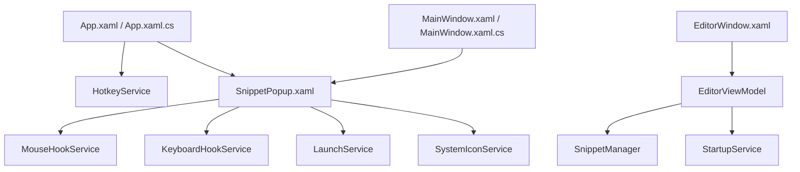

# Teritama Launcher 設計書

本ドキュメントは、WPF (.NET 10) で実装された Windows 用タスクトレイ常駐型アプリケーションランチャー「Teritama Launcher (テリタマランチャー)」の設計仕様をまとめたものです。

---

## 1. システム概要

### 1.1 背景と目的
PC作業中のアプリケーション起動やWebサイトへのアクセス、定型文やファイルの呼出しをキーボード・マウスからシームレスかつ高速に行うためのランチャーです。デスクトップやタスクバーの領域を占有せず、グローバルホットキーによって瞬時にアクセスできる快適な操作感を提供します。

### 1.2 技術スタック
* **フレームワーク**: .NET 10.0-windows (WPF)
* **設計パターン**: MVVM (Model-View-ViewModel) パターン
* **主要ライブラリ**:
  * `CommunityToolkit.Mvvm` (8.4.2)
  * `H.NotifyIcon.Wpf` (2.4.1) - タスクトレイ常駐・コンテキストメニュー
  * `Newtonsoft.Json` (13.0.4) - 設定シリアライズ

---

## 2. システムアーキテクチャ

本アプリは、疎結合で保守性の高い構造を実現するために、Win32 APIやデータの読み書きなどの依存度の高い処理を各種「Service」クラスへ切り出しています。

### 2.1 クラス関係図 (概念図)

### 2.2 主要モジュール一覧

| カテゴリ | クラス名 | 役割 |
| :--- | :--- | :--- |
| **コア / エントリ** | `App.xaml.cs` | アプリケーション全体の起動制御、ホットキー監視とポップアップメニュー表示のオーケストレーション。 |
| | `MainWindow.xaml.cs` | 非表示ウィンドウ。タスクトレイ用のアイコン定義（NotifyIcon）と右クリックメニュー。 |
| **ビュー (Views)** | `SnippetPopup.xaml.cs` | ホットキー起動時に表示されるポップアップメニュー。キーボードナビゲーションおよびサブメニュー表示を制御。 |
| | `EditorWindow.xaml.cs` | ランチャー項目の編集、自動起動設定、ホットキー設定などを行う設定UI。 |
| **サービス (Services)**| `NativeMethods.cs` | ホットキー登録、フック、ウィンドウアクティブ化などのWin32 APIを一元管理するヘルパークラス。 |
| | `SnippetManager.cs` | データのロード・保存およびバックアップ（`.bak`）処理の実行。 |
| | `HotkeyService.cs` | `RegisterHotKey` / `UnregisterHotKey` を用いたグローバルショートカットキーの監視。 |
| | `KeyboardHookService.cs` | ポップアップメニュー内での矢印キーやEscキーの入力を、低レベルキーボードフックによりキャプチャ。 |
| | `MouseHookService.cs` | ポップアップメニュー外のクリックを検知して閉じるための低レベルマウスフック。 |
| | `LaunchService.cs` | コマンドライン実行、URL展開、ファイル起動を `UseShellExecute = true` で安全にハンドリング。 |
| | `SystemIconService.cs` | 登録されたファイルパス・拡張子に対応するWindowsシステムアイコンを非同期・スレッドセーフ（Freeze化）で抽出しキャッシュ。 |
| | `StartupService.cs` | レジストリ（`SOFTWARE\Microsoft\Windows\CurrentVersion\Run`）にアプリのスタートアップ登録を反映。 |
| **モデル (Models)** | `SnippetNode.cs` | ノード情報の保持。Snippet（個別項目）、Folder（階層）、Separator（区切り線）の3種をサポート。 |
| | `AppConfig.cs` | ホットキー情報、自動起動登録状態を定義・保持するデータモデル。 |

---

## 3. データ構造と永続化仕様

### 3.1 データ保存場所
データはJSON形式で以下のパスに保存されます。
* 保存パス: `%APPDATA%\TeritamaLauncher\data.json`

### 3.2 堅牢性設計 (二重化保存)
データの保存は `SnippetManager.cs` が担当します。書き込みエラーやシステムクラッシュによるファイル破損を防ぐため、以下のフローを採用しています。

1. **保存処理**: `data.json` へのシリアライズと書き込み。
2. **バックアップ生成**: 保存成功時に、現在の正常なデータをコピーして `data.json.bak` を生成。
3. **破損時自動復元**: `data.json` の読み込み（デシリアライズ）に失敗した際、`data.json.bak` が存在すれば自動でバックアップから読み込んでリストアを試みる。

---

## 4. UI/UX 仕様と特殊制御

### 4.1 ポップアップメニュー表示位置の計算
画面の端に近い位置でホットキーが押された場合、メニューやそのサブメニューが画面外にはみ出すのを防ぐための座標計算ロジックが組み込まれています。

* **DPIスケーリング対応**: `VisualTreeHelper` や Win32 API を通してモニタごとのDPIスケール比率を抽出し、正確な座標変換を行います。
* **サブメニューの吸着表示**: 親メニューの右側にスペースがない場合は左側に表示を切り替えます。この際、親メニューの枠線とサブメニューの枠線がぴったり重なるように幅計算を行い、視覚的な隙間（余白）が生じないように制御されています。

### 4.2 低レベルフックによるフォーカス制御
ポップアップメニューが起動した際、他のフォアグラウンドウィンドウと競合することなくキーボード入力を最優先で処理するため、Windowsメッセージフック（`SetWindowsHookEx`）を併用しています。
* **キーボードフック**: メニューオープン中、`Tab` や `Enter`、`Esc`、矢印キーをフックし、確実にポップアップメニュー内のナビゲーションとして解釈させます。
* **マウスフック**: メニュー外でのクリックを検知した時点で、フックを通して即座にポップアップをクローズし、フックを安全に解除します。

### 4.3 スレッドセーフなアイコン読み込み
登録アイテムのシステムアイコンは `SystemIconService.cs` が取得します。
* WPFの `ImageSource` は別スレッドで作成されると描画スレッドで例外（`InvalidOperationException`）を発生させます。
* 本システムでは、取得した `BitmapFrame` や `BitmapSource` に対して `Freeze()` メソッドを呼び出し、読み取り専用（変更不可）状態に設定することで、複数スレッド間をまたいだ安全なキャッシュと高速描画を担保しています。
